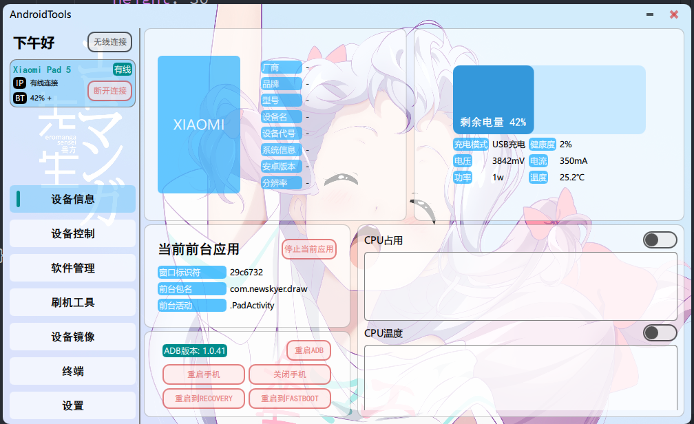
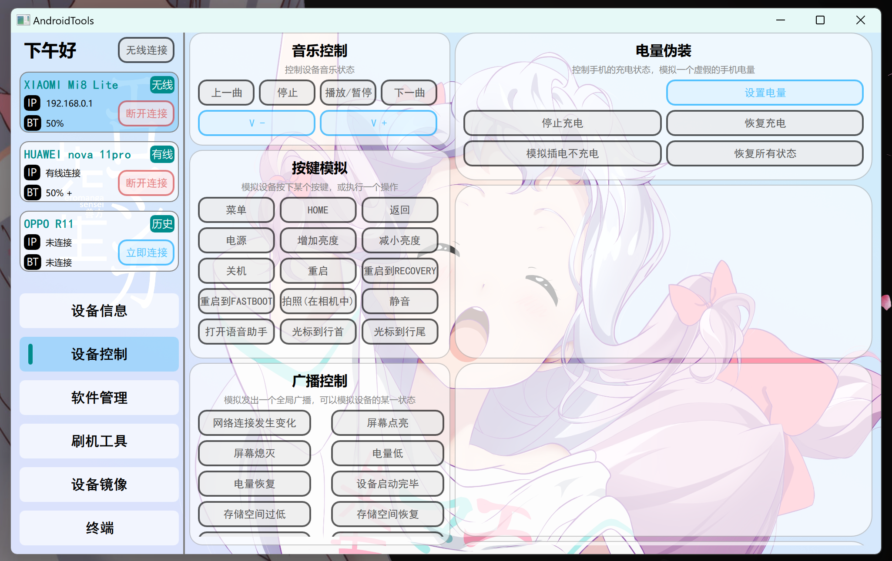

# AndroidTools-qml

## 简要介绍
一个基于Qt开发的跨平台安卓工具箱，是之前AndroidTools的QML重构版本，重写了大部分控件并独立了控件库

控件库MFloat：https://github.com/mhduiy/MFloat

## 界面展示

目前还在开发过程中，还有诸多不完善的地方

## 编译步骤

需要先编译MFloat后再编译此项目，目前适配还不完善，仅支持Windows Qt>6.2，目标是三平台兼容