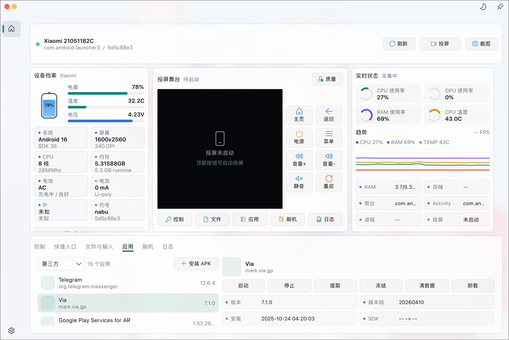

# AndroidTools

[](LICENSE)
[](https://github.com/mhduiy/AndroidTools-qml/actions/workflows/compile-project.yml)
[](https://github.com/mhduiy/AndroidTools-qml/actions/workflows/build-deb.yml)
[]()

AndroidTools is a cross-platform desktop toolbox for Android devices, built with Qt 6, QML, FluentUI, ADB/Fastboot, and scrcpy integration. It provides a compact control console for device status, screen mirroring, app management, file transfer, device control, logs, and flashing workflows.

> This is the QML rewrite of [AndroidTools](https://github.com/mhduiy/AndroidTools).



## Highlights

- Compact dashboard with device profile, screen mirroring, quick controls, and real-time metrics.
- Built-in Android device service integration for CPU, GPU, RAM, storage, battery, foreground app, process, and FPS data.
- Real-time status visualization with gauges and trend charts.
- App manager with icon loading, package details, install, launch, stop, clear data, freeze, uninstall, and APK extraction.
- Screen mirroring powered by scrcpy with quality presets, screenshots, and basic device key controls.
- File transfer, keyboard input forwarding, manual Activity launcher, resolution/DPI tools, and battery spoofing.
- Fastboot helpers for rebooting, temporary boot, flashing, erasing, and firmware maintenance.
- Fluent-style QML UI with light/dark theme, wallpaper blur, and persistent settings.

## Features

### Dashboard

- Device identity, Android version, resolution, DPI, CPU, memory, battery, IP, and serial details.
- Real-time CPU/GPU/RAM/temperature/FPS visualization.
- Foreground package, Activity, process, and mirroring status.
- Integrated quick-entry workbench for control, file/input, apps, flashing, and logs.

### Device Control

- Home, back, menu, power, volume, mute, and reboot controls.
- Media playback controls.
- Battery level and charging-state spoofing.
- Resolution and DPI modification.
- Keyboard passthrough and Activity launch.

### App Management

- List third-party, system, or all installed apps.
- Display app icons, names, packages, versions, install time, and SDK targets.
- Install APK files.
- Launch, force-stop, clear data, freeze/unfreeze, uninstall, and extract APK.

### Screen Mirroring

- Start/stop mirroring.
- Configure FPS and bitrate presets.
- Capture screenshots.
- Display mirrored frame inside the main dashboard.

### Flash Tools

- Fastboot device refresh and state management.
- Reboot to system, recovery, fastboot, or power off.
- Temporary boot image.
- Flash or erase partitions.
- Firmware package workflow entry points.

## Requirements

- Qt 6 with Core, Quick, Widgets, Gui, Network, WebSockets, QuickControls2, and Concurrent modules.
- CMake 3.20 or newer.
- ADB and Fastboot available in `PATH`.
- Android device with USB debugging or wireless debugging enabled.
- FFmpeg is required by the mirroring stack on macOS:

```bash
brew install ffmpeg
```

## Build

```bash
git clone --recursive https://github.com/mhduiy/AndroidTools-qml.git
cd AndroidTools-qml
cmake -B build -DCMAKE_BUILD_TYPE=Release
cmake --build build --parallel
```

If submodules were not cloned:

```bash
git submodule update --init --recursive
```

## Usage

1. Install Android Platform Tools and make sure `adb` and `fastboot` are in `PATH`.
2. Enable USB debugging or wireless debugging on the Android device.
3. Start AndroidTools.
4. Connect the device. The app automatically starts its device-side helper service when needed.
5. Use the dashboard to mirror, inspect, control, manage apps, transfer files, flash, and view logs.

## Project Layout

```text
src/cpp/adb                 ADB device model, commands, and Android helper service bridge
src/cpp/controlPageTool     Device control, battery spoofing, file/input tools
src/cpp/AppPageTool         App list, app details, icon loading, app operations
src/cpp/flashPageTool       Fastboot and flashing helpers
src/cpp/components          Runtime system-info provider
src/cpp/imagePageTool       Scrcpy / mirroring integration
src/qml2                    QML application UI
doc                         Screenshots and documentation assets
```

## Acknowledgments

- [QtScrcpy](https://github.com/barry-ran/QtScrcpy)
- [QmlScrcpy](https://github.com/mahdi-cpp/QmlScrcpy)
- [FluentUI](https://github.com/zhuzichu520/FluentUI)
- [awesome-adb](https://github.com/mzlogin/awesome-adb)

## License

[MIT](LICENSE)
