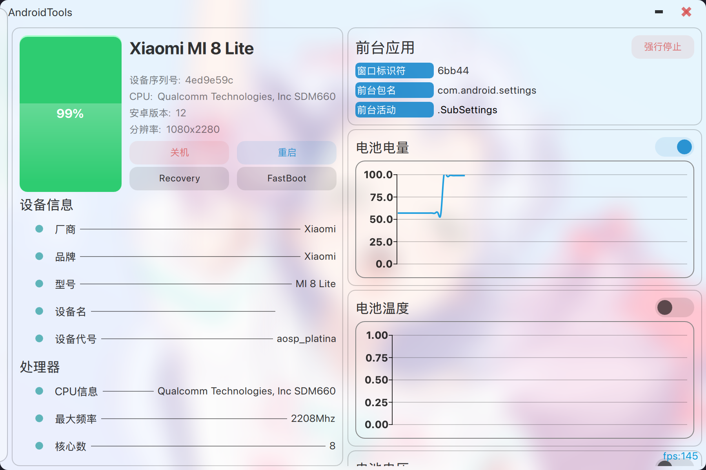

# AndroidTools-qml

## 一句话介绍
一个基于ADB工具使用Qt开发的跨平台安卓工具箱，是之前[AndroidTools](https://github.com/mhduiy/AndroidTools)的QML重构版本，你可以认为是ADB的GUI工具

https://zread.ai/mhduiy/AndroidTools-qml

## 展示图



## 为什么有这个项目

1. 兴趣使然
2. 目前有的ADB工具功能普遍偏少，而且UI比较丑，没有动画（个人很喜欢动画）
3. 巩固C++和QML的码能力
4. ...

## 计划包含哪些功能

#### 程序框架

- [x] 自定义titleBar
- [x] 无线连接
- [x] 多设备连接
- [x] 跨平台支持

#### 设备信息
- [x] 设备基础信息的展示，型号，序列号等
- [x] 电池实时信息
- [x] 前台应用管理
- [x] CPU等监控条

#### 设备控制

- [x] 音乐控制
- [x] 按键模拟
- [x] 广播控制
- [x] 电量伪装
- [x] 分辨率和DPI的修改
- [x] 文件传输
- [x] 键盘共享
- [x] activity的手动启动

#### 软件管理

- [x] 设备安装软件基本信息的查看
- [x] 软件基础操作，卸载，停止等
- [x] 提取软件，冻结解冻(旧安卓的停用功能)
- [x] 启动软件或acitivity
- [x] 安装软件
- [x] 高级安装，降级安装，覆盖安装，安装到位置SD卡等

#### 刷机工具

- [x] fastboot设备的检测
- [x] 临时启动boot
- [x] 清除/刷写指定分区
- [ ] 刷机脚本的执行（支持跨平台）
- [ ] 小米设备的快捷刷机
- [ ] 线刷包/卡刷包解包
- [ ] 线刷包转换为卡刷包
- [ ] 卡刷包转换为线刷包
- [ ] 友链
- [ ] magisk的快速修补安装

#### 设备镜像

- [x] 设备投屏
- [x] 设备截图
- [x] 投屏参数控制
- [x] 模拟点击
- [ ] 录制宏

#### 设置

- [x] 持久化存储
- [x] 深浅色切换
- [x] 壁纸的模糊和透明度
- [ ] ADB检测间隔
- [x] 元素透明度

#### 其他

- [ ] 系统托盘的设备电池图标
- [ ] exe包支持
- [ ] deb包支持
- [ ] github action的自动化构建和发布

## 编译

前提条件

- Qt6

## 拉取子模块

```bash
git submodule init
git submodule update --remote
```

或者

```bash
git clone --recurse-submodules https://github.com/mhduiy/AndroidTools-qml.git
```

## 如何使用

1. 安装ADB => https://developer.android.com/tools/releases/platform-tools?hl=zh-cn
2. 将ADB工具的bin目录添加到PATH环境变量
3. 待连接设备需要开启开发者模式中的USB调试或无线调试
4. 打开本软件即可自动检测设备进行连接
5. 可以开始使用啦

## 其他展示图


## 致谢

开发本项目参考了以下项目，谢谢大佬们

[QmlScrcpy](https://github.com/mahdi-cpp/QmlScrcpy)

[QtScrcpy](https://github.com/barry-ran/QtScrcpy)

[FluentUI](https://github.com/zhuzichu520/FluentUI)

[awesome](https://github.com/mzlogin/awesome-adb)
